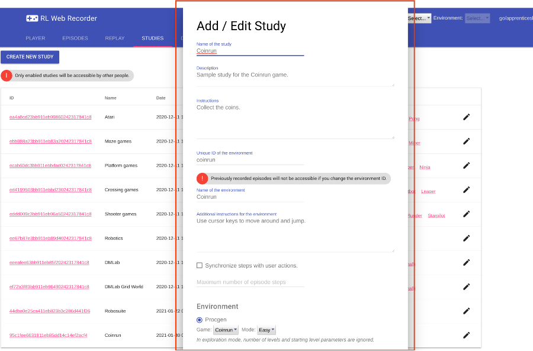
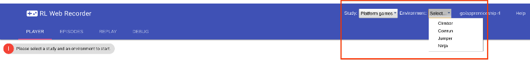
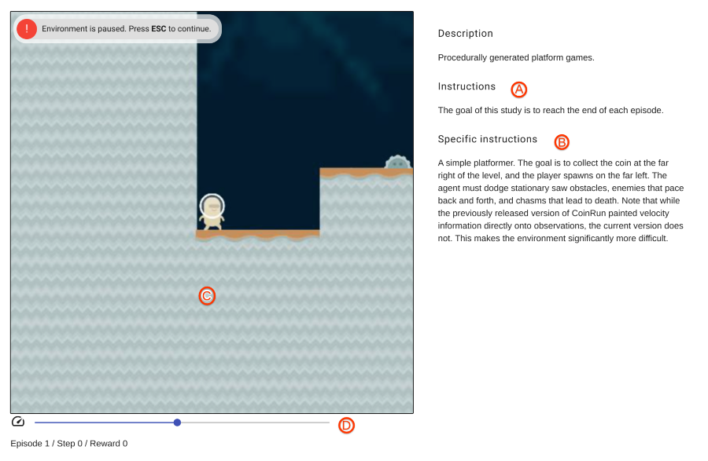
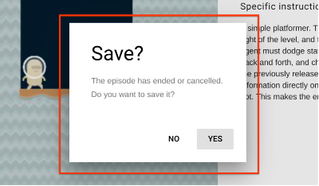
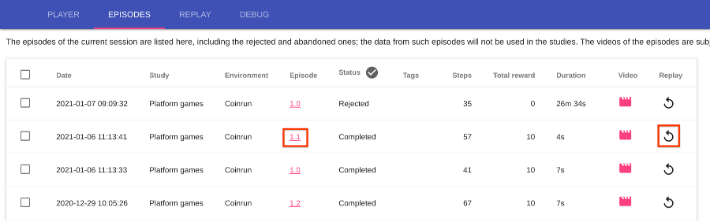
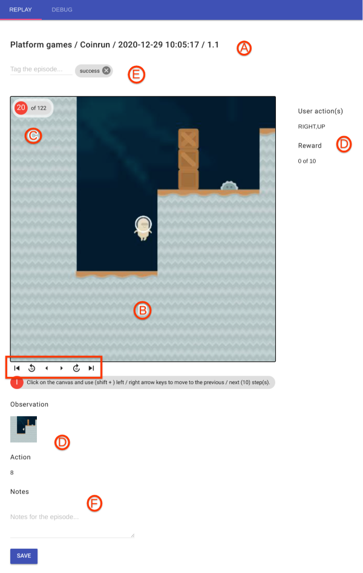
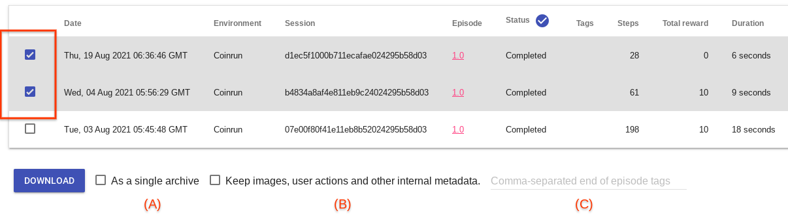
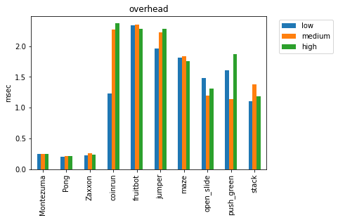
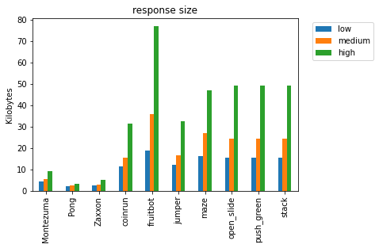
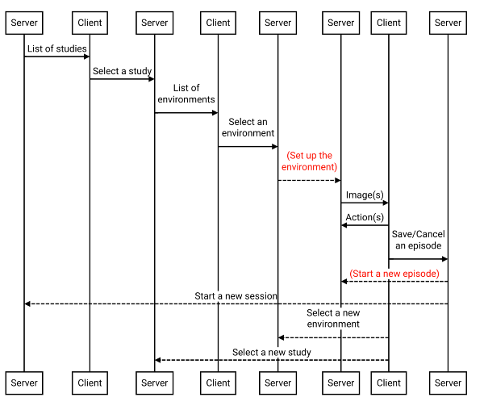

# RLDS Creator

A web-based tool to collect human data from simulated environments.

[TOC]

## Overview

The main goal of RLDS Creator is to facilitate human data collection from
simulated environments, e.g. for imitation or reinforcement learning. We try to
accomplish this by providing an easy to use web-based tool. A study designer
creates a **data collection study** by defining:

*   the specifications of the environments, e.g. a set of Atari games,
*   the instructions for the users, i.e. what is the goal of the study and what
    to do, e.g. to reach a target score.

The users then can enroll to the study and interact with the environments
defined in the study, e.g. play the Atari games. The interactions, including the
user actions, the resulting transitions in the environment and the visual
output, i.e. rendered images, and other metadata are recorded and stored in a
format that can be loaded back later for analysis or to train agents.

## Usage

### Creating a new study

To create a new study, go to "Studies" tab and click "Create New Study" button.
This will display the dialog that allows you to enter the specification of the
study, e.g. its name, description, (additional) instructions and the
configuration of the environment (e.g. the game and level information for
Procgen).



After saving the study, it will be added to the studies table. You can click on
the study ID or environment name to test it and record episodes.

#### Editing an existing study

To edit an existing study, go to "Studies" tab and click on its edit button. In
RLDS Creator, it is possible to define studies with multiple environments (e.g.
different platform games, or versions of the same environment with different
parameters), but online editing is limited to studies with a single environment.

### Data collection

#### Recording an episode

1.  Select a study and an environment.

    

1.  In the "Player" tab, the instructions for the study (A) and optionally the
    more specific instructions for the environment (B) will be displayed. Please
    read them carefully.

    In the canvas (C), you can see a visual representation of the environment,
    i.e. the image for the current step or frame. When the canvas is
    highlighted, i.e. has a thin black border, it will accept input from the
    user. You can use **ESC** key to pause / resume the environment and
    **ENTER** key to start a new episode. Other keys differ for each
    environment, but in general the cursor and W, A, S, D keys are for movement
    and SPACE key is for taking an action. Gamepad controllers and SpaceMouse
    are also supported.

    It is possible to make the environment run faster or slower using the speed
    bar (D). If an environment is synchronous, i.e. advances step by step after
    each user action, then the speed bar will be disabled; there is also no need
    to pause or resume such an environment.

    

1.  After an episode ends (either successfully or with failure), you will be
    asked to confirm whether to save it or not. The episode will be marked as
    completed if confirmed, otherwise as rejected.

    

#### Replaying a recorded episode

1.  Select a study and go to "Episodes" tab. Click on the link of an episode or
    the replay button:

    

1.  In the "Replay" tab, you can see the metadata of the episode (A) and the
    visual representation of the environment for the current (initially the
    starting) step or frame (B).

    Use the buttons in the navigation bar to advance; the step counter (C)
    indicates the current step and the total number of steps in the episode.
    Alternatively, when the canvas is highlighted you can use (SHIFT +) LEFT /
    RIGHT cursor key to move to the previous / next (10) step(s).

    For each step, the user actions together with the actual observation and
    action in the environment and the obtained reward will be displayed (D). You
    can add / remove custom tags to an episode (E) as well as free-text notes
    (F). It is also possible to tag steps, e.g. to indicate important events,
    such as accomplishing a (sub)goal. These tags can be later used for
    filtering purposes in the exported datasets (see
    [below](#download-dataset)).

    

### Downloading the collected data {#download-dataset}

Select a study from the tool and go to "Episodes" tab. On this tab, you can
select a subset of recorded episodes for the study and retrieve the link to
download the dataset that contains them.



The structure of the dataset will depend on the episode storage type (e.g.
Pickle or Envlogger) and may contain multiple files and directories. By default,
the dataset will be stored preserving its structure. You can use the "as a
single archive" option (A) to download the dataset as a single ZIP file.

Together with the environment data (e.g. observations and actions), RLDS also
saves the rendered images that were shown to the user, user actions (i.e.
pressed keys or controller input) and auxiliary information returned by the
environment at each step. They are stored in the step metadata so that the
episodes keep the entire context and are self-contained. In most cases, these
internal metadata may not be needed in the generated dataset (e.g. when training
a RL agent) and are stripped out. To keep them, check the corresponding option
(B). Please note that (i) the rendered images can increase the size of the
dataset significantly and (ii) the user actions and auxiliary information may
not have a fixed shape causing issues when loading the dataset, requiring
further processing and transformation.

In some environments and studies, the termination of episodes may not be
explicit, e.g. an episode may end after a fixed number of steps or the study may
involve multiple tasks with different termination conditions that are decided
after data collection. When generating the datasets for such cases, it may be
desirable to truncate the episodes at the proper steps. For this purpose, you
can use the tagging feature in the replay tool to tag the "termination" steps of
the episodes and specify these tags as "end of episode tags" when downloading a
dataset (C). This will truncate the episodes in the dataset at the corresponding
steps.

## Supported environments

The list of supported environments and their specifications are defined in the
EnvironmentSpec message (see study.proto file); these include

*   [Atari](https://github.com/openai/atari-py): Atari 2600 games from Arcade
    Learning Environment (ALE).
*   [DeepMind Lab](https://github.com/deepmind/lab): A 3D environment based on
    Quake III Arena.
*   [Procgen](https://openai.com/blog/procgen-benchmark): Procedurally generated
    (video game) environments from OpenAI.
*   [RoboDesk](https://github.com/google-research/robodesk): RoboDesk includes a
    diverse set of tasks that test for a variety of different behaviors within
    the same environment, making it useful for evaluating transfer, multi-task
    learning, and global exploration.
*   [Robosuite](https://robosuite.ai): Robosuite is a modular simulation
    framework and benchmark environments for robot learning; see
    https://robosuite.ai for more information.

On a standard workstation, the overhead of RLDS Creator (i.e. mainly encoding of
the images and recording of the videos) is between 0.5-2.0 msecs for each step
depending on the complexity of the environment and the resolution of the images.
Below, we plot the sample overhead for various Atari, Procgen and Robodesk
environments using different quality settings.



This is also correlated with the size of the data that is sent to the client.



## Installation

### Building from the source

You can use Bazel to build the (server) binary:

```shell
$ TARGET_DIR=/path/of/the/repository

$ cd $TARGET_DIR
# experimental_inprocess_symlink_creation option is required for dependencies
# with assets with spaces in their paths.
$ bazel build --experimental_inprocess_symlink_creation //rlds_creator:server
```

This will create the `server` binary under the `bazel-bin/rlds_creator`
directory. Most of the dependencies are installed automatically by Bazel
(defined in `WORKSPACE.bazel` file), but a few of them (e.g. Mujoco, DeepMind
Lab, Atari ROMs, OpenGL) need to be installed explicitly. Please see
`docker/Dockerfile` file for the sample instructions to install these
dependencies; you can also use the provided `build.sh` script to build the
Docker image.

```shell
$ cd $TARGET_DIR; sh docker/build.sh
```

### Running the tool

Run the `server` binary specifying the port and other options.

```shell
$ cd $TARGET_DIR; python3 bazel-bin/rlds_creator/server --port=$PORT
```

By default, the study and episode metadata will be stored in an in-memory SQLite
database (hence, non-persistent) and the trajectories will be saved under the
`/tmp/rlds_creator_logs` directory. Please see the command line flags in
`server.py` file to use more persistent options and for more information.

## How does it work?

RLDS Creator has two components:

*   a server that manages the studies and runs the environments based on user
    actions, and
*   a web client that displays the visual representation of the current state in
    an environment to the user and sends user actions, e.g. keyboard input, to
    the server

The web client is simply a viewer and the core logic resides in the server. We
use [WebSockets](https://en.wikipedia.org/wiki/WebSocket) to establish a
bi-directional (session level) communication channel between the server and the
client. The protocol followed for recording an episode is as follows:



The study specifications and the metadata about user sessions and recorded
episodes are stored in a database.

### Workflow

The regular workflow is as follows:

1.  The study designer creates a data collection study, e.g. *action games in
    Procgen*, specifying

    1.  the specifications of the environments, i.e. *the list of action games
        in Procgen and their parameters*, and
    1.  the instructions for the users, i.e. what is the goal of the study and
        what to do, e.g. *"play the games"*. There can be optional additional
        instructions for each environment, e.g. *"the goal in this game is to
        collect the coins and avoid the obstacles and enemies"*.

    and starts the study.

1.  A user opens the online tool, selects the study and starts a session to
    interact with the environments in the selected study. In a session,

    1.  User selects an environment in the study, e.g. *a particular action game
        such as "Coinrun"*, and views the instructions for the study and
        environment, if available.
    1.  A new episode in the environment begins. In most cases, the environment
        will be initially in paused state to let the user get ready.
    1.  User starts working on the episode by interacting with the environment,
        i.e. sees a visual representation of the current state and takes
        actions. At any point during the interaction loop, the user can

        1.  Pause the environment temporarily; if it is not unpaused after some
            time, the session will expire and the episode will be marked as
            abandoned.
        1.  Cancel the episode; the episode will be marked as cancelled.

    1.  When the episode ends (with success, e.g. collecting all coints or
        failure, e.g. hitting an enemy), the user is asked to confirm whether to
        save it or not. The episode will be marked as completed if confirmed,
        otherwise as rejected. After this, user can end the session, continue
        with a new episode of the current environment, or choose another
        environment in the study.

1.  The study designer queries the sessions and recorded episodes for the study
    and downloads the data.

It is possible to replay a recorded episode on the client, i.e. view the actions
of the user, the observation, action and reward for each step of an episode.

## Acknowledgements

We greatly appreciate all the support from the
[TF-Agents](https://github.com/tensorflow/agents) team in setting up building
and testing for RLDS Creator.

## Disclaimer

This is not an officially supported Google product.
